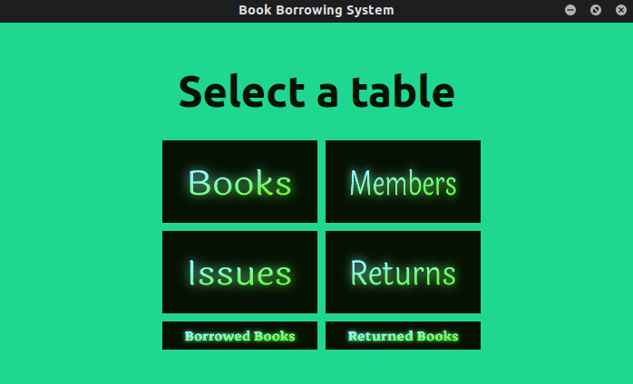
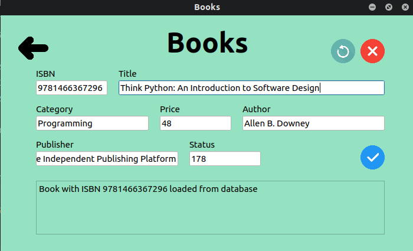
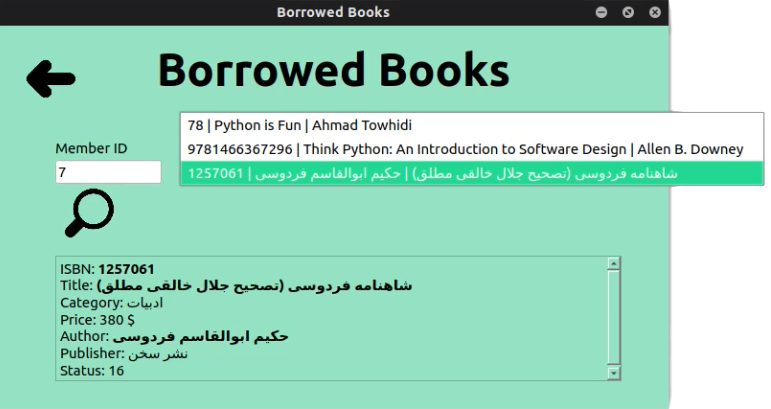

# Book Borrowing System

## Interface
### 
- User Friendly
### 
- Add, Delete, Updare and Load a record
### 
- Perfectly support UTF-8

## Instalation
- Install requirements `pip3 install -r requirements.txt`

## Usage
- Run the interface: `python3 ui.py`
